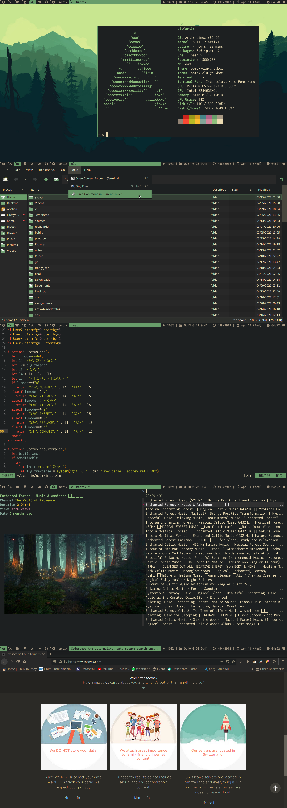

---

**Distro:** Artix Linux

**Window Manager:** dwm

**GTK/Icons:** custom oomox (numix-based)

**Terminal emulator:** rxvt-unicode

**Fonts:** Inconsolata Nerd Font Mono, Material Design Icons

**File Manager:** PCManFM (graphical), fff (terminal)

**Youtube Player/Browser:** [ytfzf](https://github.com/pystardust/ytfzf)

**neovim statusline:** custom (included in dotfiles)

**Search engine:** [swisscows](https://swisscows.com/)

[wallpaper](https://wallpapercave.com/w/wp4892339)

**dwm patches applied:**
- colorbar
- fakefullscreen
- sticky
- swapfocus
- switchtotag
- uselessgaps
- viewontag

